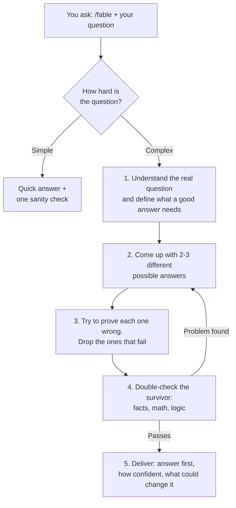

# Fable Reasoning Protocol

Make any AI model think more carefully before it answers.

**Author:** Akhil Gupta ([GitHub](https://github.com/akhilguptahub) | [LinkedIn](https://www.linkedin.com/in/akhilgupta1998/))
**Version:** 1.3.0 | **License:** MIT (free to use, see plain-English summary below)

> **Independent project.** Built by Akhil Gupta as a personal optimization tool, because these thinking patterns proved useful in his own product work. Not affiliated with, sponsored by, or endorsed by Anthropic. Contains no Anthropic code or model material, only publicly documented prompting techniques. Claude, Fable, and Mythos are Anthropic trademarks, mentioned only to describe what inspired this.

## The idea in one paragraph

Most bad AI answers happen for a simple reason: the model answers too fast. It grabs the first idea that looks right, never considers alternatives, and never checks its own work. Top-tier models like Claude Fable 5 are known for doing the opposite: they plan first, test several possible answers against each other, and review their work before showing it. Those are habits, and habits can be written down. This skill teaches those habits to whatever model you already use.

## How it works



No settings, no setup beyond installing. The skill decides how much effort each question deserves, so simple questions stay fast and cheap.

## What you get

| Without this skill | With /fable |
|---|---|
| First idea, polished to sound confident | 2-3 ideas tested against each other, best one wins |
| Answers the question as typed | Works out what you actually need first |
| "Here's your answer" | "Here's the answer, here's how sure I am, here's what would change it" |
| Mistakes found by you, later | Model reviews its own work before you see it |
| Same effort for everything | Fast on easy questions, thorough on hard ones |

**Who it helps:** anyone making decisions with AI. Product and business calls, code debugging, architecture choices, analysis, research, pricing, strategy. It shines wherever a wrong answer is expensive. Bonus: it makes cheaper models (Haiku, Sonnet) noticeably better, so you don't need the most expensive model for every task.

**What it is not:** magic. It can't give a small model a big model's brain. It removes the avoidable mistakes, which in practice is a large share of them.

## Install (2 minutes)

**Claude Desktop / Cowork** (easiest)
Drop `fable-v1.3.0.skill` into any Claude chat and click **Save skill**.

**Claude.ai (web)**
Settings > Capabilities > Skills > **Upload skill** > pick the file.

**Claude Code (terminal)**
The file is a normal zip. Unzip it, move the `fable` folder into `~/.claude/skills/`, restart.

**Antigravity, Codex, Cursor, or any other AI tool**
These don't read skill files, but the method is just text:
1. Unzip and open `fable/SKILL.md`
2. Copy everything below the top `---` block
3. Paste it into your tool's instructions file (`AGENTS.md` for Antigravity/Codex, `.cursor/rules/` for Cursor) or straight into the chat as your first message

## Use it

Type `/fable` before any question, in any model:

```
/fable Our signups dropped 18% after the last release. What's the most likely cause?
```
```
/fable Should a 5-person team use one big codebase or split services? Recommend one.
```
```
/fable Review this pricing plan before I present it to the board.
```

Or just say "use fable mode" or "think like Fable" in plain words.

## License, in plain English

MIT license means: anyone can use, copy, share, and modify this for free, including at work. The only rule is my name and the license text stay attached. It's provided as-is, so I'm not responsible for what any model outputs when you use it. Full legal text is in the LICENSE file.

## Sources

- [Claude Fable 5 announcement, Anthropic](https://www.anthropic.com/news/claude-fable-5-mythos-5)
- [Chain-of-thought prompting, Claude docs](https://docs.anthropic.com/en/docs/build-with-claude/prompt-engineering/chain-of-thought)

Questions, feedback, improvements: [github.com/akhilguptahub](https://github.com/akhilguptahub)
